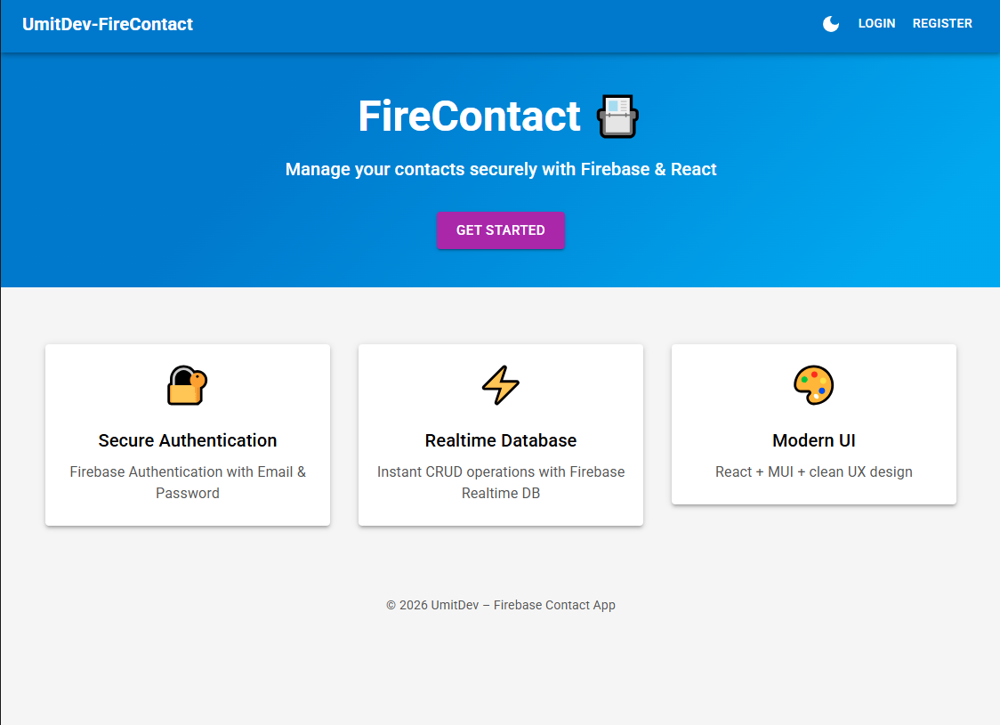
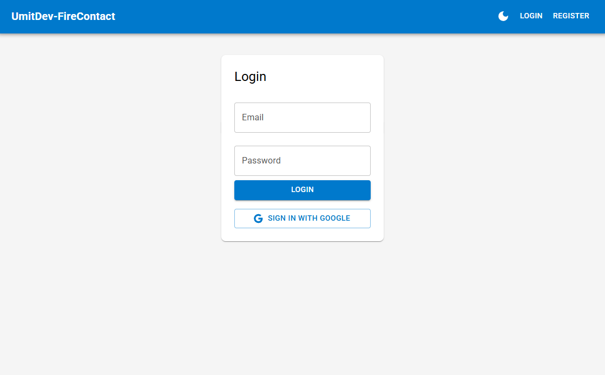
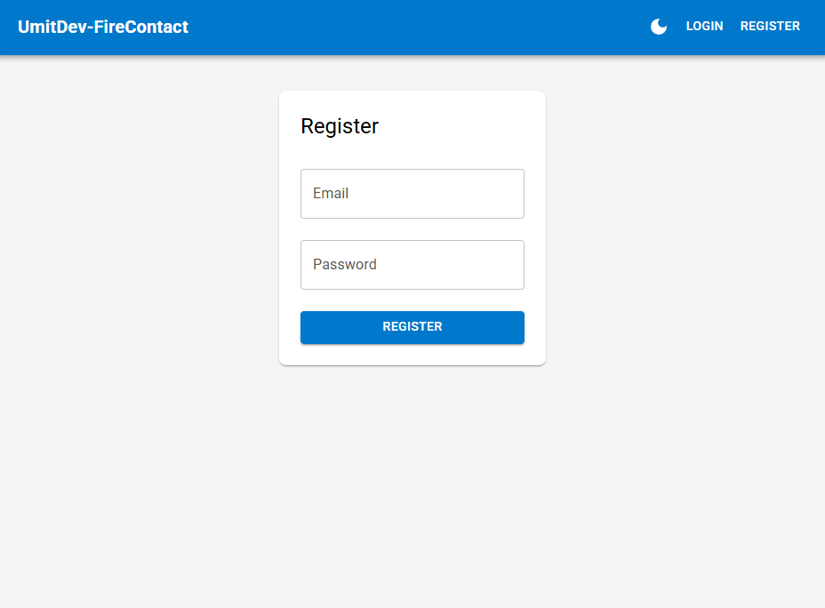
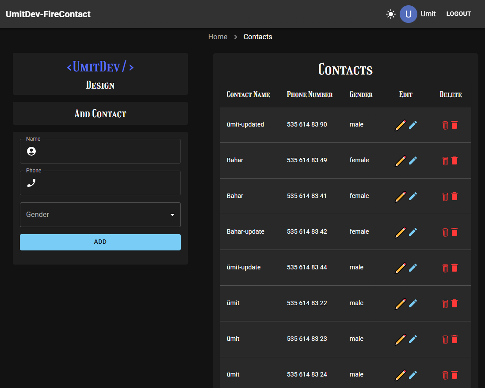

<p align="center">
  
  
  
</p>

<h1 align="center">📌 React Firebase Contacts App</h1>

<p align="center">
A modern contact management app with Firebase authentication & real-time database.
</p>


<div align="center">
  <h3>
    <a href="https://contacts-app-umitdev.netlify.app">
      🖥️ Live Demo
    </a>
     | 
    <a href="https://github.com/umitarat-dev/Contacts-App.git">
      📂 Repository
    </a>
  </h3>
</div>

<p align="center">
  <a href="https://contacts-app-umitdev.netlify.app">
    
  </a>>
</p>

## 📚 Navigation

- [✨ Overview](#-overview)
- [📖 Description](#-description)
- [🚀 Features](#-features)
- [🗂️ Project Skeleton](#️-project-skeleton)
- [🛠️ Built With](#️-built-with)
- [⚡ How To Use](#-how-to-use)
  - [🔐 Google Authentication Note](#-google-authentication-note)
- [📌 About This Project](#-about-this-project)
- [🙏 Acknowledgements](#-acknowledgements)
- [📬 Contact Information](#-contact-information)

---

## ✨ Overview

<div align="center"> 

  
  
  --- 
  
   

  ---
   

  ---
  

  ---

</div>


 
## 📖 Description

🔸 React ve Firebase kullanılarak geliştirilmiş modern bir Contact Management Application’dır.

🔸 Kullanıcılar:
  * Email/Password veya Google ile giriş yapabilir
  * Kendi contact listesini oluşturabilir
  * Contact ekleyebilir, güncelleyebilir ve silebilir

🔸 Uygulama, authentication tabanlı korumalı route yapısı ile yalnızca giriş yapmış kullanıcıların /app alanına erişmesine izin verir.

🔸 🌙 Dark / Light Theme (theme context, palette, UI uyumu)

🔸 Proje boyunca temiz kod, component bazlı mimari ve modern React best practice’leri hedeflenmiştir.

---

## 🚀 Features

* 🔐 **Firebase Authentication**
  * Email / Password
  * Google Sign-In
* 🛡️ **Protected Routes** 
  * Login olmadan /app erişimi yok
* 📇 **Contact CRUD**
  * Add
  * Update
  * Delete
* 🚫 **Duplicate phone number validation**
* 🎨 **Material UI (MUI)** ile modern UI
* 🌗 **Dark-Light Mode**
  * ThemeContext + MUI ThemeProvider
  * Kullanıcı tercihine göre anlık tema değişimi
* 📱 **Responsive design** (Mobile & Desktop)
* ☁️ **Firebase Realtime Database**
  * Kullanıcı bazlı veri izolasyonu
* 🧠 **Context API**
  * Authentication & Theme yönetimi
* ⚛️ **React Router v6** ile client-side routing
  * Client-side routing
* 💬 **React-Toastify**
  * Kullanıcı geri bildirimleri
* 🚀 **Netlify Deployment**
  * SPA refresh sorunu
  * _redirects / cache meselesi
  
---

## 🗂️ Project Skeleton

```
src/
 │
 |----readme.md   
 │
 ├─ utils/
 │   ├─ auth.js
 │   ├─ firebase.js
 │   ├─ functions.js
 │   ├─ toastify.js
 │   └─ validators.js
 │   
 ├─ components/
 │   ├─ contacts/
 │   │   └─ Contacts.jsx
 │   ├─ navbar/
 │   │   ├─ ThemeToggle.jsx
 │   │   └─ Navbar.jsx
 │   └─ form/
 │       └─ FormComponent.jsx
 │   
 ├─ context/
 │   └─ AuthContext.jsx
 │   
 ├─ helpers/
 │   └─ ToastNotify.js
 │   
 ├─ pages/
 │   ├─ Login.jsx
 │   ├─ Landing.jsx
 │   └─ Register.jsx
 │   
 ├─ routes/
 │   └─ ProtectedRoute.jsx
 │
 ├─ theme/
 │   └─ ThemeContext.jsx
 │   
 ├─ App.css
 ├─ App.jsx
 ├─ index.css
 └─ main.jsx
```

---

## 🛠️ Built With

- [⚛️ React](https://react.dev/)  
- [🔥 Firebase Authentication](https://firebase.google.com/)
- [🔥 Firebase Realtime Database](https://firebase.google.com/)
- [🧭 React Router v6](https://reactrouter.com/) 
- [🎨 Material UI (MUI)](https://mui.com/)
- [💬 React-Toastify](https://fkhadra.github.io/react-toastify/introduction/)
- [🌐 Netlify](https://www.netlify.com/)

---

## ⚡ How To Use

🔸 To clone and run this application, you'll need [Git](https://git-scm.com/), [Node.js](https://nodejs.org/), and a package manager (`yarn` or `npm`) installed on your computer.

```bash
# Clone this repository
$ git clone https://github.com/umitarat-dev/Contacts-App.git

# Navigate into the project folder
$ cd Contacts-App

# Install dependencies
yarn  
yarn dev

# or using npm
npm install
npm run dev
```
🔸 Then open http://localhost:3000 to view it in your browser.

---

### 🔐 Google Authentication Note

🔸 If you deploy the app to Netlify (or another hosting provider),  
make sure to add your deployed domain to Firebase:

🔸 Firebase Console → Authentication → Settings → Authorized domains

🔸 Otherwise, Google Sign-In will work locally but fail in production.

- Example:
```txt
umitdev-firecontact.netlify.app
```

🔸 Without this step, Google Authentication will be blocked in production.

---


## 📌 About This Project

🔸 Bu proje;
  * Modern React component mimarisi
  * Authentication & authorization mantığı
  * CRUD operasyonları
  * Helper function kullanımı
  * UI / UX polish
  * Dark / Light theme yönetimi (MUI Theme)
  * Implemented Google Authentication with proper post-login routing using React Router
  * Dynamic Navbar based on authentication state
  * Firebase user profile (displayName, photoURL) rendering
  * Firebase ile frontend entegrasyonu
konularını gerçek bir uygulama senaryosu üzerinden pekiştirmek amacıyla geliştirilmiştir.


---

## 🙏 Acknowledgements

- [🎓Clarusway](https://clarusway.com/) – for the training resources
- [📘React Documentation](https://react.dev/)
- [🔥 Firebase Docs](https://firebase.google.com/)
- [🧭React Router Docs](https://reactrouter.com/en/main/start/overview)
- [💬 React-Toastify Docs](https://fkhadra.github.io/react-toastify/introduction/)
- [🌐 Netlify Docs](https://www.netlify.com/)

---

## 📬 Contact Information

I am always open to discussing new projects, creative ideas, or opportunities to be part of your visions.

* **LinkedIn:** [linkedin.com/in/umit-arat](https://www.linkedin.com/in/umit-arat/)
* **Email:** [umitarat8098@gmail.com](mailto:umitarat8098@gmail.com)
* **GitHub:** [github.com/umitarat-dev](https://github.com/umitarat-dev) (Current Workspace)